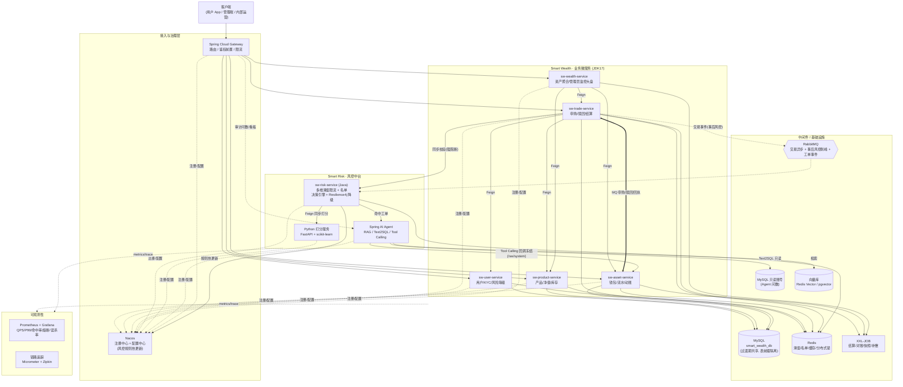
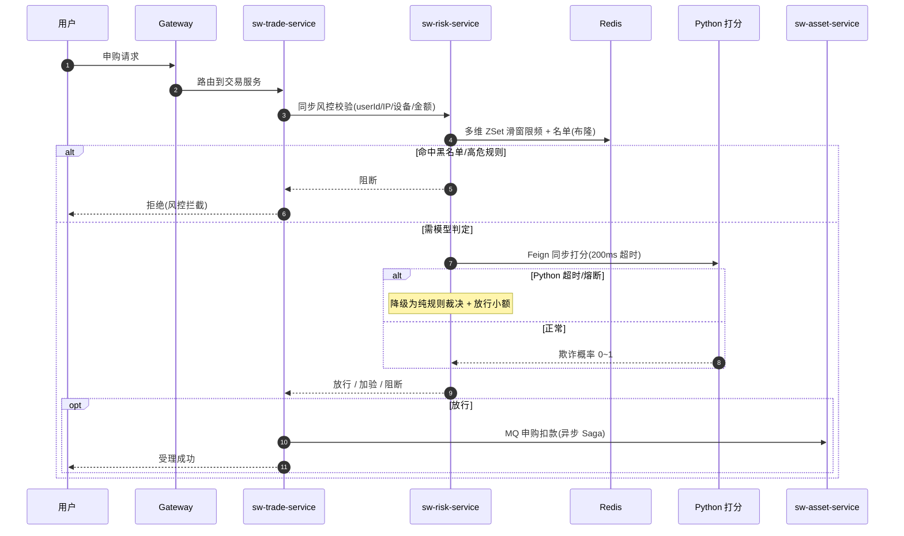
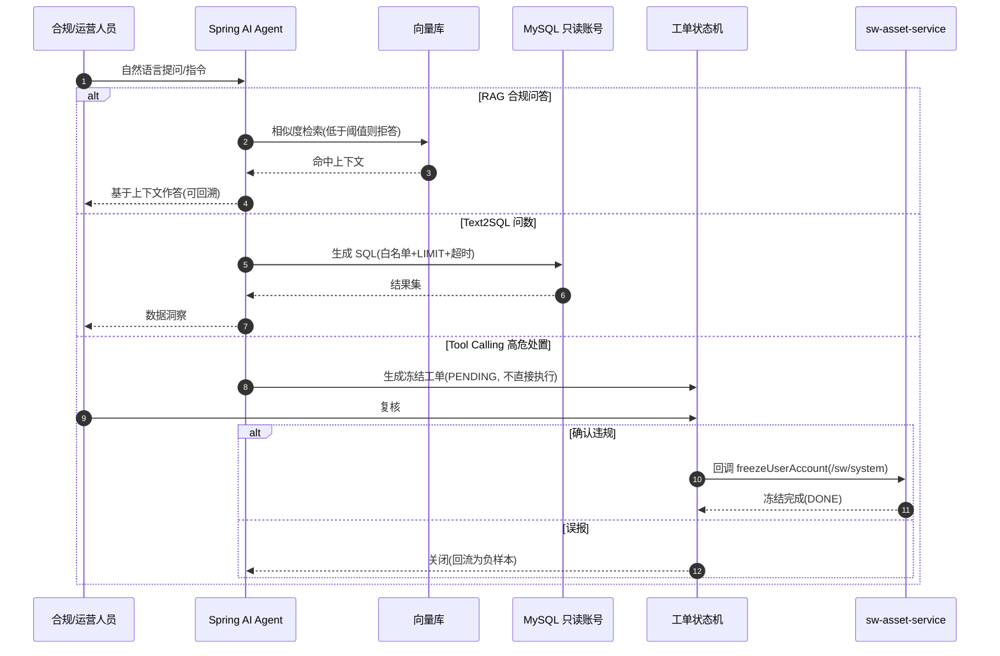

# Smart Wealth 全平台改造方案（分阶段路线图）

> 目标：将现有「模块化单体」逐步演进为「Spring Cloud 渐进式微服务」，并在此基础上扩建《Smart Risk》风控审查中台。
> 原则：**每个阶段都可独立交付、可回滚、不破坏现有业务**。先还债、再增强、后拆分、最后扩建。

---

## 〇、现状快照（改造起点）

| 维度 | 现状 | 改造影响 |
|---|---|---|
| 部署形态 | 单 JVM、单 Spring Boot（`sw-web-start`，端口 8099） | Phase 3 拆成 N 个独立应用 + Gateway |
| 数据库 | 单 schema `smart_wealth_db`，无从库、无动态数据源 | 渐进式：过渡期保持共享库 |
| 跨模块调用 | 名义上走 `sw-api` SPI，**实际多为直接注入 `Internal*Service` 实现类**，甚至跨模块直接用对方 `Mapper`/`entity` | Phase 1 先规范化，Phase 3 才能换 Feign |
| 异步链路 | RabbitMQ（trade↔asset 申购/赎回）+ 本地消息表 + XXL-JOB 补偿 | 拆分时**保留并复用**，是天然服务边界 |
| Spring Cloud | `spring-cloud` BOM + `openfeign` 已在 pom，但**完全未使用**（dead code） | Phase 3 激活 |
| 内部接口预留 | `InternalServiceFilter`（IP 白名单 → `ROLE_INTERNAL_SERVICE`）、`/sw/system/**` 安全规则已就绪，但**无对应 controller** | Phase 4 风控回调接入点 |
| wealth 管理员监控 | 仅 1 个接口 `GET /sw/admin/wealth/asset-summary`，全量 `selectList` HOLDING 订单进内存循环，无 SQL 聚合/无缓存/无分页 | Phase 2 重点增强 |

### 已识别的关键技术债（Phase 1 清理目标）
1. `sw-module-wealth` **不依赖 `sw-api`**，直接 import 了 asset/trade/product 的 `entity`，并调用了大量**不在 SPI 上**的 impl 方法（`selectList` / `selectPageDaily` / `getById` 等）。
2. `Tradetransactionhelper` 在赎回事务里**直接注入了 product 模块的 `ProdInfoMapper`**。
3. `RabbitmqConfirmConfig`（trade 模块）**直接操作 asset 模块的 `AssetLocalMsgMapper`**。
4. 管理端 controller 类名 `wealthcontroller`（小写，非规范）。
5. `sw-module-wealth` 声明了 `sw-module-user` 依赖但**从未使用**。
6. 平台看板非空路径**未 `setScale`**，与用户侧精度处理不一致；NAV 缺失静默按 0 计算，会低估 AUM。

### 跨模块强耦合点（Phase 3 拆分时的「拆弹清单」）
- **申购**：`Tradetransactionhelper.createOrderAndMessage` 一个事务里写 trade 表 + 锁 product 库存（DB CAS）。
- **赎回**：一个事务跨 asset 钱包 `FOR UPDATE` + product NAV 重读 + trade 写库（`InternalAssetApi.selectprelock` 明确要求「在调用方事务内执行」）。
- **注销账户**：user 在 `@Transactional` 里发同步事件，trade 用同步 `@EventListener` 抛异常**回滚 user 事务**（强一致跨模块）。
- 这三处**不能简单换成远程调用**，需要 Saga / 本地消息表 / 异步校验改造。

---

## 一、总体路线图与依赖关系

```
Phase 1  单体完善 & 技术债清理        （为后续拆分扫清耦合，低风险）
   │
   ▼
Phase 2  wealth 管理员监控增强        （依赖 Phase 1 的 SPI 规范化；可独立交付）
   │
   ▼
Phase 3  Spring Cloud 渐进式微服务    （依赖 Phase 1 的解耦；最高风险）
   │       3a Nacos+Gateway+Config（不拆应用，先注册自己）
   │       3b 抽取边缘服务（user/product/wealth）
   │       3c 抽取核心服务（asset/trade，处理分布式事务）
   ▼
Phase 4  Smart Risk 风控中台          （依赖 Phase 3 的服务注册 & 内部接口）
           4a Java 风控服务（限流+规则+熔断降级）
           4b Python 算法服务（FastAPI + sklearn 打分）
           4c Spring AI Agent（RAG → Text2SQL → Tool Calling）
```

**渐进式微服务总原则**：
- 数据库**先共享后拆分**。Phase 3 阶段所有服务仍连同一个 `smart_wealth_db`，靠「表前缀 + 模块只读自己表」的纪律约束；真正 schema-per-service 留作 Phase 5（可选）。
- 通信优先级：**已有 MQ 链路保持不变** > 读类调用换 Feign > 强一致写类调用最后处理。
- 每抽取一个服务，旧的 in-process 调用要能**通过开关回退**（Feign client 与本地 bean 二选一），降低风险。

---

## 二、Phase 1：单体完善 & 技术债清理

> 目的：在不改变部署形态的前提下，把「跨模块只能走 SPI」这条纪律**真正落到代码**，为 Phase 3 换 Feign 铺路。这一步全部是内部重构，对外接口零变化。

### 1.1 SPI 契约补全（`sw-api`）
- 把 wealth / trade 当前「绕过 SPI 直接调 impl」的方法，**收敛进 `sw-api` 接口**或改为通过现有 SPI 组合实现。需要新增的契约（草案）：
  - `InternalAssetApi`：`getWalletByUserId`、`pageUserFlows(type, page)`（替代 wealth 直接 `selectPage`）。
  - `InternalTradeApi`：`listHoldingOrderValuation()`（返回聚合后的市值/浮盈，**而不是把订单实体丢出来**）、`pageDailyProfit(userId, query)`。
  - `InternalProductApi`：补 `getProdDetail(id)`（替代 wealth/trade 直接 `getById`）。
- **原则**：SPI 出参一律用 `sw-api` 内定义的轻量 DTO，**严禁透传业务 `entity`**。

### 1.2 消除实体/Mapper 泄漏
- `sw-module-wealth`：加上 `sw-api` 依赖，移除对 asset/trade/product `entity` 的 import，全部改走 1.1 的 SPI DTO。
- `Tradetransactionhelper`：移除 `ProdInfoMapper` 直接注入，NAV 重读改走 `InternalProductApi.getProdDetailForUpdate(id)`（注意：此调用仍需在同事务内，Phase 1 仍是同进程，安全）。
- `RabbitmqConfirmConfig`：trade 不再直接写 asset 的本地消息表；改为各模块各自维护自己的本地消息表，confirm 回调按模块路由（已有 `MSG_*` 前缀可用于分流）。

### 1.3 调用方注入接口而非实现
- 全工程把 `@Autowired Internal*Service`（impl）改为 `@Autowired Internal*Api`（interface）。
- 这一步让 Phase 3 可以「同名接口、Feign 实现替换本地实现」零成本切换。

### 1.4 小修小补
- `wealthcontroller` → `WealthAdminController`（规范命名）。
- 移除 `sw-module-wealth` 未使用的 `sw-module-user` 依赖。
- 平台看板金额统一 `setScale(4, HALF_UP)`；NAV 缺失改为告警 + 跳过而非静默按 0。

**交付物**：编译通过、对外接口不变、所有跨模块调用经 `sw-api`。
**验证**：现有申购/赎回/结算/对账链路回归（手动 + 现有 JMeter 脚本）。

---

## 三、Phase 2：wealth 管理员全平台监控增强

> 覆盖你勾选的四项：**性能优化 + 运营健康 + 核心指标 + 趋势历史**。核心思路：**实时大盘走 SQL 聚合 + 缓存；历史趋势走 T+1 快照表**。

### 2.1 性能优化（替代全量内存循环）
- 新增聚合 SQL，把「Σ(quantity × nav)」尽量下推：
  - 持仓市值/浮盈：用 `t_trade_order` 按 `prod_id` 分组 `SUM(quantity)`、`SUM(amount)`，再 join 最新 NAV（少量产品行）在内存合并。避免把每一条 HOLDING 订单 load 进 JVM。
  - 钱包总额：沿用已有 `SUM(balance)`。
- 实时大盘结果进 Redis 缓存（TTL 30~60s + 随机抖动），key 例：`sw:wealth:dashboard:realtime`。管理员刷新不再每次全表扫。

### 2.2 核心指标扩充（新 VO 字段）
- 用户维度：注册用户数、KYC 通过数、当日活跃/新增。
- 交易维度：累计/当日申购笔数与金额、赎回笔数与金额、HOLDING 订单数。
- 产品维度：在售产品数、各产品 AUM Top N、各风险等级资金分布。
- 收益维度：**已实现收益 vs 浮动收益拆分**（已实现来自 `t_trade_daily_profit` 汇总，浮动来自实时重估）。
- 资金流维度：当日资金流入（充值+申购）/ 流出（提现+赎回）净额（可复用 asset 模块已有 `FlowStatisticsVO`）。

### 2.3 趋势与历史（T+1 快照）
- 新增表 `t_wealth_platform_daily_snapshot`（按天一行）：AUM、总余额、总持仓市值、已实现收益、浮动收益、用户数、申购/赎回笔数金额……
- 新增 XXL-JOB `dailyPlatformSnapshotJob`（每日结算 + 对账之后，约 05:00 跑）：把当日各项指标落快照表。
- 新增接口 `GET /sw/admin/wealth/trend?dimension=day|week|month&from=&to=`：直接查快照表返回走势曲线，**不实时计算历史**。

### 2.4 运营健康度面板
- 聚合现有但「没被 surface 出来」的健康信号到一个接口 `GET /sw/admin/wealth/ops-health`：
  - 对账异常：复用 `dailyAssetCheckJob` / `dailyTradeCheckJob` / `sharePoolCheckJob` 的结果（需要把它们的告警**落库**到 `t_ops_check_result`，目前只写 WARN 日志）。
  - 消息死信：扫 `t_*_local_msg` 中 `status=2`（死信）数量与明细。
  - 风险账户：占位接口，Phase 4 风控接入后回填。
- **附带改造**：把三个对账 JOB 的结果从「只打日志」改为「落库 + 日志」，否则面板无数据可读。

### 2.5 接口清单（Phase 2 新增/改造）
| 方法 | 路径 | 说明 |
|---|---|---|
| GET | `/sw/admin/wealth/asset-summary` | 实时大盘（改造为 SQL 聚合 + 缓存） |
| GET | `/sw/admin/wealth/metrics` | 全维度核心指标快照 |
| GET | `/sw/admin/wealth/trend` | 历史走势（查快照表） |
| GET | `/sw/admin/wealth/ops-health` | 运营健康度（对账/死信/风险） |

**交付物**：4 个管理端接口 + 1 张快照表 + 1 张对账结果表 + 1 个快照 JOB。
**验证**：造数后核对聚合值与逐笔计算一致；趋势接口 T+1 数据正确。

---

## 四、Phase 3：Spring Cloud 渐进式微服务

> 渐进式、共享库、按 6 模块拆。**不追求一步到位，按「先注册、再抽边缘、后抽核心」三步走**，每步可回滚。

### 3a. 基础设施就位（不拆应用）
- 引入 **Nacos**（注册中心 + 配置中心），先让现有单体把自己注册上去、配置外置到 Nacos。
- 引入 **Spring Cloud Gateway**（新建 `sw-gateway` 模块），统一入口，路由先全部指向单体。
- 鉴权下沉策略：JWT 校验可保留在各服务（共享 `sw-common` filter），Gateway 先只做路由 + 限流；后续可把鉴权上提到 Gateway。
- **此阶段对外行为零变化**，纯粹把「注册/配置/网关」骨架立起来。

### 3b. 抽取边缘服务（依赖少、无强一致写）
抽取顺序按耦合度从低到高：
1. **`sw-module-product`** → `sw-product-service`（被依赖多但自身依赖少；NAV/库存读多）。
2. **`sw-module-user`** → `sw-user-service`（风险等级、KYC）。
3. **`sw-module-wealth`** → `sw-wealth-service`（纯读聚合，最适合远程化）。
- 做法：每个抽出的服务是独立 Spring Boot app + 独立端口 + 注册到 Nacos。
- 把 Phase 1 规范化的 `sw-api` 接口做成 **Feign client**（接口同名，`@FeignClient(name="sw-xxx-service")`）。调用方通过开关在「本地 bean / Feign」间切换，灰度验证。
- **注意**：`InternalProductApi.lockStock`（赎回 NAV 重读）等需在事务内的调用，远程化后**不再保证与调用方同事务**——这类调用要么留在核心服务内、要么改造（见 3c）。

### 3c. 抽取核心服务（处理分布式事务，最高风险）
- **`sw-module-asset` + `sw-module-trade`** 是分布式事务重灾区。策略：
  - **申购/赎回**：已经是 `trade → MQ → asset → MQ → trade` 异步链路 + 本地消息表，**天然就是 Saga 雏形**，拆分后基本保持不变，只需各自连库、各自维护本地消息表（Phase 1 已拆开）。
  - **赎回事务里的「asset 钱包 FOR UPDATE + product NAV 重读」**：这是当前同事务强一致点。拆分方案：
    - 钱包占用改为 trade 侧发起「冻结预占」命令（asset 提供幂等的冻结/解冻接口），用 **TCC 或预占-确认** 模型替代跨服务 `FOR UPDATE`。
    - NAV 重读改为 trade 本地缓存最新 NAV + 校验版本号。
  - **注销账户的同步回滚**：从「user 事务内同步事件抛异常」改为 **「先校验后执行」的编排**：user 发起注销 → 编排器调用 trade/asset 的「可注销校验」接口（同步只读）→ 全通过再软删。避免跨服务事务回滚。
- 这一阶段建议**最后做、单独排期**，且保留「合并回单体」的回退预案。

### 3d. 配套
- 配置：各服务 `application.yml` 拆分，公共配置进 Nacos Config（datasource/redis/rabbitmq/jwt-secret）。
- 可观测性：建议引入链路追踪（Sleuth/Micrometer + Zipkin 或 SkyWalking），微服务排障必需。
- 服务间内部调用鉴权：复用现有 `InternalServiceFilter`（`/sw/system/**` + IP 白名单 / 内部 token）。

**交付物**：Nacos + Gateway + 6 个独立服务 + Feign 化的 `sw-api`。
**风险控制**：3b/3c 每抽一个服务都先灰度（开关切流），保留单体可回退。

---

## 五、Phase 4：Smart Risk 风控审查中台（全套）

> 全套技术栈：Java 风控服务 + Python(FastAPI + sklearn) + Spring AI（RAG / Text2SQL / Tool Calling）。
> **注意**：实现时已修正原 `gemini-code` 方案里的若干硬伤（见 5.4）。

### 4a. Java 风控服务 `sw-risk-service`
- 注册到 Nacos，作为 Smart Wealth 的**旁路**（不在主交易资金链路上）。
- 风控分**两条链路**：同步强阻断（毫秒级、在交易关键路径上）+ 异步事后扫描（秒~分钟级、MQ 削峰、不阻塞交易）。
- **同步实时防刷链路**：
  1. 上游（Gateway 或 trade 服务）通过 MQ/HTTP 把交易特征（userId、IP、设备指纹、金额、时间）投给风控。
  2. **多维 Redis ZSet 滑动窗口**限频：对 **用户 / IP / 设备** 多维分别 `ZADD` 时间戳 → `ZREMRANGEBYSCORE` 清理过期 → `ZCARD` 取窗口计数，Lua 脚本保证原子性，O(log N)。
  3. **名单前置过滤**：布隆过滤器拦黑名单、白名单放行、灰名单加严。
  4. **决策引擎裁决**（见 4b）。
  5. 命中模型层时调用 Python 打分服务（见 4c）。
  6. **降级熔断**：Resilience4j 配置「200ms 超时 + 慢调用比例阈值触发熔断」（**超时 ≠ 熔断，分开配**），熔断时**降级为纯规则裁决 + 放行小额**。
- **同步调用用 Feign（默认阻塞）**；如需异步用 `WebClient`/`@Async`，**不写「Feign 异步」这种错误表述**。
- **异步事后扫描链路**：交易事件经 RabbitMQ 投递到事后消费者，跑更重的特征聚合/行为序列异常检测，命中风险生成工单（不直接冻结）。

### 4b. 风控决策引擎（可配置 + 热更新 + 灰度）
- **分层裁决**：① 名单层（黑/白/灰，布隆过滤器 + Redis）→ ② 规则层（表达式规则集）→ ③ 模型层（Python 打分）→ 加权融合（规则分 × w1 + 模型分 × w2）映射为 `放行 / 加验 / 阻断`。
- **规则可配置 + 热更新**：规则用表达式引擎（Aviator / QLExpress）描述（如 `freq_1min > 10 && amount > 50000`），存 **Nacos 配置中心**，改完无需发版即时生效；支持规则分级与命中权重。
- **影子模式（Shadow Mode）/ 灰度**：新规则/新模型先影子运行（照常计算但不真正阻断），对比拦截率/误杀率，验证后再切生效，避免误伤真实用户。

### 4c. Python 算法服务（FastAPI + scikit-learn）
- 独立服务，注册到 Nacos（或经 Gateway 暴露）。
- 明确特征与模型，不写「加载特征评估逻辑」这种空话：
  - 特征：近 N 分钟交易频次、金额偏离度、IP/设备聚集度、时段异常。
  - 模型：先用 LogisticRegression / 简单 XGBoost，离线训练 + 持久化（joblib），在线 `POST /score` 返回 0~1 欺诈概率。
  - 没有真实数据时用规则生成的合成样本训练，**面试时如实说明是 LR + 合成数据起步**。

### 4d. Spring AI 智能合规 Agent（三级演进）
- **Level 1 RAG**：合规手册切片 → Embedding → 向量库（Redis Vector / 备选 pgvector、Milvus）。System Prompt 严格约束「只用 context 回答」；相似度低于阈值则拒答（**阈值经调参确定，不写死 0.8**）。
- **Level 2 Text2SQL**：注入只读 DDL，LLM 生成 SQL → 在**只读账号**上执行。安全三件套：① 库级只读权限；② SQL 解析白名单（仅 SELECT、限表限字段、禁子查询写）；③ 强制 LIMIT + 超时。
- **Level 3 Tool Calling**：注册 `freezeUserAccountTool` 等工具。LLM 决定冻结时**不直接执行**，降级为 `PENDING` 工单，经合规人员确认后才回调 Smart Wealth 的内部接口执行（人机协同状态机）。
- **Level 4（进阶·可选）**：ReAct 多步推理 + 短期记忆，Guardrails 输出校验 + 离线 Eval 评测集，语义缓存降低重复问答的 token 成本。

### 4e. 可观测性与工程化闭环
- **决策可回溯**：每次裁决落审计日志（命中规则、模型分、最终动作、耗时），支持复盘与申诉。
- **指标监控**：Micrometer → Prometheus → Grafana 看板（QPS、P99 决策延迟、规则命中率、熔断状态、误杀率）。
- **样本闭环**：工单复核结论（确认违规 / 误报）回流为正负样本，定期重训模型。
- **数据隔离**：风控读 Smart Wealth 走**只读账号**，绝不写主库；风险数据独立存储。

### 4f. Smart Wealth 侧需要配合的改造
- 暴露内部接口（走已有 `/sw/system/**` + `InternalServiceFilter`）：
  - `freezeUserAccount(userId)` / `unfreezeUserAccount(userId)`（user 或 asset 服务实现）。
  - 风控查询所需的只读数据接口。
- 风控判定结果回填到 Phase 2 的「运营健康度 - 风险账户」面板。

### 4g. Phase 4 里程碑（与 `gemini-code` 对外稿对齐）
| 里程碑 | 内容 | 价值 |
|---|---|---|
| M1 | Java 风控服务：多维滑窗限流 + 名单 + Resilience4j 降级 | 跑通同步强阻断，主链路可降级 |
| M2 | 决策引擎：规则表达式 + Nacos 热更新 + 影子模式 | 风控策略可配置、可灰度 |
| M3 | Python 打分服务：FastAPI + sklearn（LR 起步，合成样本训练） | 引入模型层，规则+模型融合 |
| M4 | 事后风控异步链路 + 工单状态机 + 可观测看板 | 削峰、人机协同、可运营 |
| M5 | Spring AI：RAG → Text2SQL → Tool Calling | 智能合规问答与自动化处置 |
| M6（可选） | Agent 进阶（ReAct、Guardrails、Eval、语义缓存降本） | 差异化与降本 |

**交付物**：`sw-risk-service`（Java，含决策引擎）+ Python 打分服务 + Spring AI Agent + 可观测看板 + Smart Wealth 内部接口。

---

## 六、风险登记与回退策略

| 阶段 | 主要风险 | 缓解 / 回退 |
|---|---|---|
| 1 | 重构引入回归 | 接口零变化 + 全链路回归；小步提交 |
| 2 | 聚合 SQL 与逐笔计算不一致 | 上线前用对账脚本比对；快照 JOB 幂等可重跑 |
| 3b | 远程调用替代本地 bean 后性能/超时 | 开关灰度切流，保留本地 bean 回退 |
| 3c | 分布式事务破坏资金一致性 | **最后做**；TCC/预占模型 + 本地消息表补偿；保留合并回单体预案 |
| 4 | LLM 生成 SQL / 工具调用安全 | 只读账号 + SQL 白名单 + 工单人工复核 |

---

## 七、建议的下一步

1. **先评审本方案**，确认拆分粒度、wealth 指标清单、风控接入点是否符合预期。
2. 评审通过后，**从 Phase 1 开始**（纯内部重构、风险最低、且是后续一切的基础）。
3. 每个 Phase 结束产出可运行版本 + 简短验收说明，再进入下一个。

> 备注：`gemini-code-1780216907994.md` 作为《Smart Risk》的「对外叙事/简历稿」，已修正原稿 4 处技术表述（OpenFeign 异步、超时=熔断、99.99% 可用性、50Hz 数据流）并补齐决策引擎/影子模式/可观测闭环，与本方案 Phase 4（含 M1~M6 里程碑）口径一致。

---

## 九、改造后系统架构图

> 改造完成（Phase 1~4 全部落地）后的目标态视图：一张整体拓扑 + 两张关键链路时序图。

### 9.1 全系统整体拓扑（Spring Cloud + Smart Risk）



### 9.2 实时风控强阻断链路（同步，毫秒级）



### 9.3 智能合规 Agent 处置链路（人机协同）



> 图例说明：实线 = 同步调用 / 强阻断；虚线 = 经 MQ 的异步事后风控；过渡期 MySQL 共享单库（表前缀隔离），schema-per-service 为后续可选项；`trade ↔ asset` 的 MQ 异步 Saga 为现有最可靠解耦点，拆分后保持不变；AI 回调走现成的 `/sw/system` 内部接口通道。
